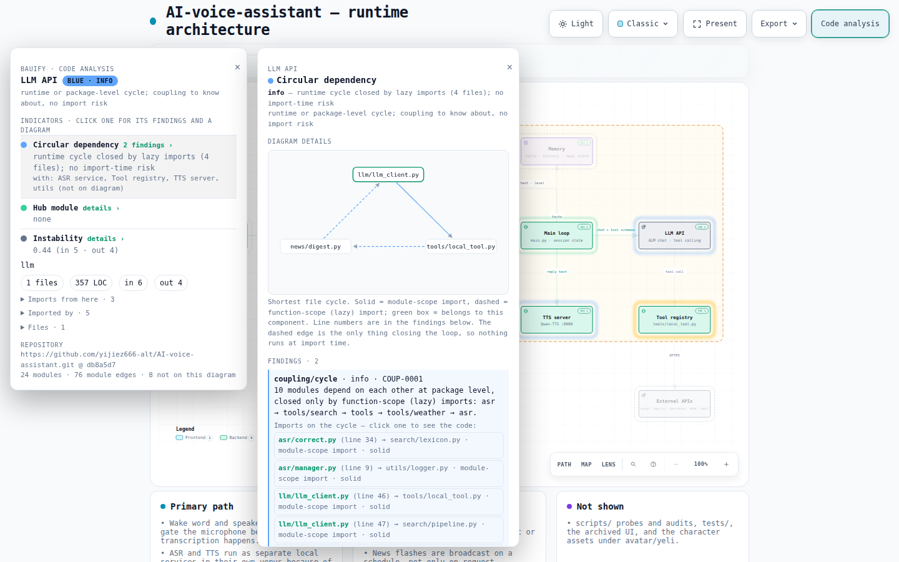

# Bauify

Deterministic, evidence-first code analysis that layers what a codebase
*imports* onto the architecture diagram an agent or a person drew with
[Archify](https://github.com/tt-a1i/archify).

Bauify answers one question from static evidence alone: is the module
coupling reasonable? It reads the source, resolves every import, folds files
into modules, runs a small set of rules, and reports what it found as facts —
each one traced to a file, line, import edge, and commit — rather than as a
verdict on the design. Bauify never executes the analyzed code and never
calls an LLM.

```
target repo ─▶ extract ─▶ graphs ─▶ evaluate ─┐
                 │           │         │       ├─▶ overlay ─▶ repo.analysis.html
            raw-facts   module-graph  findings │
                                               │
   architecture.json ─▶ Archify deliver ─▶ repo.html
   (hand-authored)
```

Archify validates, lays out, and renders; Bauify owns language parsing,
module resolution, and dependency accuracy. They are separate installs. Bauify
never modifies the IR or the delivered HTML — `overlay` writes a new file
next to it, and with the **Code analysis** button off that file is exactly
Archify's artifact.

## What you get



With **Code analysis** on, the authored diagram and guided views recede and
every component gets a halo just outside its box, coloured by danger level;
a legend next to the button spells the levels out:

| colour | level | meaning |
|---|---|---|
| red (pulsing) | critical | a load-time import failure is proven from the facts |
| amber | warning | an eager import cycle whose behaviour depends on import order, or a hub module |
| blue | info | a cycle closed only by lazy imports, or one that exists only at package level — coupling to know about, no import risk |
| green | clean | no rule fired |
| grey | unmapped | no source code maps to this component |

Clicking a component opens a panel with its indicators (circular dependency,
hub module, instability), the mapped modules, every file with LOC and import
counts, and the module edges with file:line evidence. Clicking an indicator
opens a second panel with the findings behind it and a small diagram Bauify
draws to explain them: the cycle as a ring with lazy edges dashed, the hub as
a star of dependents and dependencies with links to its source files,
instability as in/out bars. Every file:line a finding cites is a button; with
`--source` it opens the whole file in a third, draggable panel, scrolled to
the cited line. GitHub links are pinned to the analyzed commit. No import
lines are drawn on the diagram itself.

## Quick start

```bash
git clone https://github.com/yijiez666-alt/bauify.git && cd bauify && npm ci
```

Node ≥ 18. Python 3.8+ on `PATH` (`python3`, `python`, or the `py` launcher)
is needed only for Python repositories; `BAUIFY_PYTHON` picks an interpreter
explicitly. The commands below assume a checkout of `tt-a1i/archify` next to
this one.

```bash
# 1. analyze the repository: raw-facts, module-graph, findings (and a bridge IR, see below)
node bin/analyze.mjs run ../ai-voice-assistant --language py --out out/ai-voice --json

# 2. deliver the hand-authored diagram with Archify, as usual
node ../archify/archify/bin/archify.mjs deliver architecture \
  examples/ai-voice.manual.architecture.json out/ai-voice-manual/repo.html \
  --quality standard --repo-root ../ai-voice-assistant --json

# 3. layer the analysis on top — a new file; the delivered HTML is untouched
node bin/analyze.mjs overlay out/ai-voice-manual/repo.html \
  examples/ai-voice.manual.architecture.json out/ai-voice/module-graph.json \
  --map examples/ai-voice.overlay-map.json --source ../ai-voice-assistant \
  --out out/ai-voice-manual/repo.analysis.html --json
```

Open `out/ai-voice-manual/repo.analysis.html`. The same three steps on
Archify's own package use `../archify/examples/archify-repo.architecture.json`
and `examples/archify.overlay-map.json` (`run ../archify/archify`, no
`--language` needed).

Components map to modules through the `sources` in the IR; `--map` overrides
that with `{"componentId": ["moduleId", …]}` (module ids are in
`module-graph.json`; `examples/ai-voice.overlay-map.json` pairs with
`examples/ai-voice.manual.architecture.json`). Modules no component claims
are listed in the panel as "not on this diagram" rather than dropped.
`overlay` picks up `raw-facts.json` and `findings.json` next to the module
graph automatically. `--source <analyzed dir>` embeds the full text of every
file a finding cites — only those files, not the repository; without it the
code references still link to GitHub.

## Rules

Findings come from `evaluate`, which runs every rule independently and echoes
each threshold it used into the finding's evidence so a reader can re-check
the call. A cycle is reported as a fact with `evidence.risk.loading` rather
than as a judgment about the design; "LLM calls tools, a tool calls the LLM
back" is a normal runtime shape, and Bauify says so instead of flagging it.

- `coupling/import-cycle` — file-level import cycles from raw-facts, in
  tiers. **info**: the cycle is closed only by function-scope (lazy) imports;
  no eager cycle exists and nothing runs at import time (`loading:
  none-at-import`). **warning**: every edge is a module-scope import.
  Python tolerates this in general — the second module finds the first one,
  partially initialised, in `sys.modules` — so behaviour depends on import
  order (`order-dependent`). **error**: the failure is proven — file B does
  `from A import X` and A binds `X` after the import that leads back to B,
  so the named load order raises *cannot import name 'X' from partially
  initialized module* (`proven-failure`, with the failing order, chain, and
  lines in `evidence.proof`). The proof needs the adapter's module-scope
  symbols, which the Python adapter emits; TypeScript never goes above
  warning.
- `coupling/cycle` — package-level strongly connected components on the
  module graph; info. Often an artifact of directory grouping; it points at
  `import-cycle` for whether any file actually cycles.
- `coupling/hub` — a module that is both widely depended on and depends
  widely (fan-in ≥ 5 and fan-out ≥ 5 by default; warning). A coordination
  point, not a bug; the dependents list usually shows where a split would go.

Rules are independent modules under `evaluate/rules/`; `coupling/layer-violation`
and the `redundancy/*` family are next. See [ARCHITECTURE.md](ARCHITECTURE.md)
for the design, the full rule catalog, and the feasibility triage behind it,
and [docs/TECH-GUIDE.md](docs/TECH-GUIDE.md) for a walk through the
technology behind each stage.

## Pipeline

- `extract` — JS/TS via the TypeScript Compiler API; Python via the standard
  library `ast` (relative imports, packages, PEP 420 namespace packages,
  `importlib.import_module` literals, function-scope imports flagged `lazy`,
  module-scope symbol bindings with their line). Output is schema-validated
  and byte-deterministic.
- `graphs` — folds file edges into modules (explicit groups > package
  boundary > directory depth; root-level files are modules of their own),
  with fan-in / fan-out / instability and up to five file:line evidence
  entries per edge. Test and generated files are excluded and counted.
- `evaluate` — the rules above, stable ids (`COUP-0001`), `config.ignore`
  to suppress a rule.
- `overlay` — the analysis layer described above, injected into a copy of an
  Archify-delivered HTML.
- `bridge` — an Archify `architecture` IR generated from the module graph
  (one column per module, layered lanes, at most 12 nodes, evidence mode when
  the repository has a 40-hex revision and a github.com origin). It renders
  and passes `deliver`, but a folded dependency graph is far more detailed
  than a diagram a person would draw, so the overlay on a hand-authored map
  is the main path and the bridge is kept as a capability. `run` still
  writes it.
- `run` — extract → graphs → evaluate → bridge into one directory.

```bash
node bin/analyze.mjs run      <repo-root> --out <dir> [--language ts|py] [--config file.json] [--json]
node bin/analyze.mjs extract  <repo-root> [--out raw-facts.json] [--language ts|py] [--json]
node bin/analyze.mjs graphs   raw-facts.json [--out module-graph.json]
node bin/analyze.mjs evaluate module-graph.json [--facts raw-facts.json] [--out findings.json]
node bin/analyze.mjs bridge   module-graph.json [--out repo.architecture.json]
node bin/analyze.mjs overlay  <archify.html> <ir.json> <module-graph.json> --out <analysis.html> [--map …] [--source …]
```

A tree containing both JS/TS and Python files must name the language; Bauify
refuses to guess. Every failure exits non-zero with one structured diagnostic
(`code / severity / subject / evidence / supportedFixes`); `--json` never
prints a stack trace.

Unresolved imports are kept and counted, never dropped: `external` (bare or
`node:` specifier), `outside` (resolved beyond the analyzed root), `unknown`
(path-like but missing), `opaque` (`import()` / `require()` / `import_module()`
with a computed argument). A module reached only through `spawnSync` or a
computed `import()` therefore shows no edge — the count says so.

Configuration (all optional; see `config/defaults.json`):

```json
{
  "include": ["**/*.py"],
  "exclude": ["**/venv*/**", "**/logs/**"],
  "modules": { "depth": 2, "groups": { "core": ["src/core/**"] }, "excludeRoles": ["test", "generated"] },
  "rules": { "coupling": { "hub": { "fanIn": 5, "fanOut": 5 } } },
  "ignore": [],
  "bridge": { "maxNodes": 12, "minWeight": 1, "qualityProfile": "standard", "types": { "ui": "frontend" } }
}
```

## For Archify users

Nothing in your workflow changes. Keep authoring the IR and running
`archify deliver`; then run `bauify run` on the repository and `bauify
overlay` on the delivered HTML. Bauify depends on a few hooks in Archify's
viewer — `g[data-node-id]`, `path[data-edge-id]`, `.toolbar`, and the
`--panel` / `--panel-border` / `--bg` / `--text` / `--text-muted` CSS
variables — and on nothing else; it reads the IR only to map components to
modules.

## Tests

```bash
npm test
```

Fixture and regression tests run anywhere, including the tiers of
`import-cycle` (a proven partial-initialisation failure is checked against a
real `ImportError`). The tests that analyze Archify's own package or call
Archify's validator need a checkout of `tt-a1i/archify`: a sibling
`../archify` is used by default; set `BAUIFY_ARCHIFY_ROOT` to point
elsewhere. They are skipped, not failed, when it is absent. CI pins that
checkout to a fixed revision.

## Known limits

- Only `from module import name` is analysed for the partial-initialisation
  proof; a module-scope `module.attr` access on a half-built module is not
  detected and stays a warning.
- Archify's `showcase` profile rejects every edge crossing. A module map
  folded from a real dependency graph is usually non-planar, so the bridge
  declares `standard` by default; dense graphs render with crossing warnings
  rather than failing.
- The bridge layout is one column per module, so a map with many top-level
  modules is wide and a deep chain is tall. Compaction is parked with the
  bridge.

## Origin

Bauify started as a proposed `analyzers/` subsystem of Archify
([PR #352](https://github.com/tt-a1i/archify/pull/352)). Archify's author
suggested keeping code analysis in an external tool so Archify can stay
focused on validation and rendering; this repository is that tool, with the
PR's history and authorship preserved. See [NOTICE](NOTICE).

## License

MIT — see [LICENSE](LICENSE).
