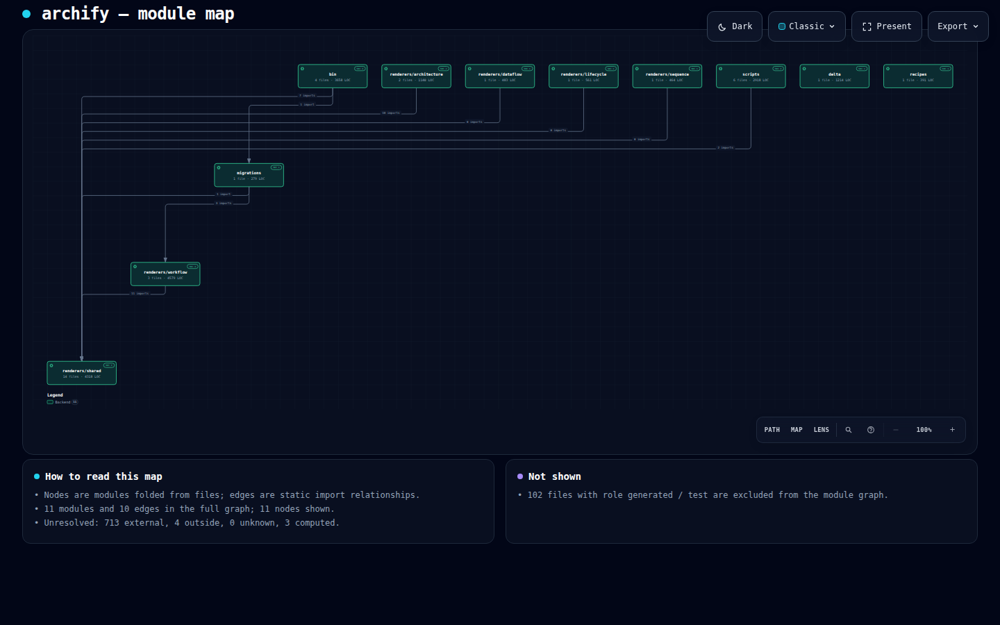
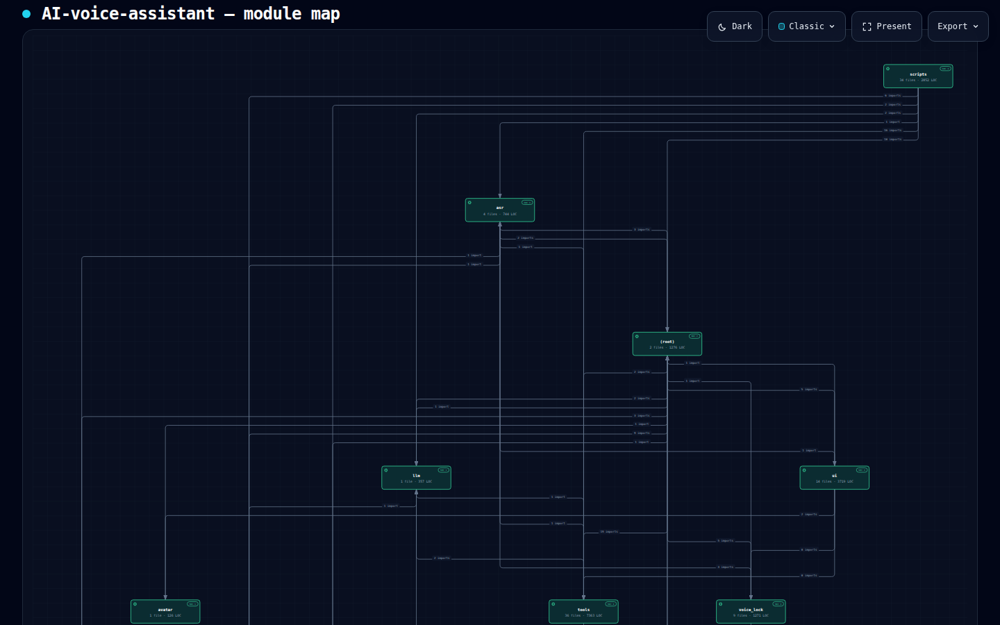

# Bauify

Deterministic, evidence-first code analysis that produces facts, a module
graph, and [Archify](https://github.com/tt-a1i/archify) architecture IR.

Bauify answers two questions about a repository from static evidence alone:
is the module coupling reasonable, and is the code concise? Every fact it
emits traces back to a file, line, import edge, or commit. Bauify never
executes the analyzed code and never calls an LLM; explanation is left to
whoever consumes its JSON.

```
target repo ─▶ extract ─▶ graphs ─▶ bridge ─▶ Archify (validate / deliver)
                 │           │         │
            raw-facts   module-graph   repo.architecture.json
```

Archify validates, lays out, and renders; Bauify owns language parsing,
module resolution, and dependency accuracy. The two are separate installs
that meet at Archify's existing typed JSON IR — nothing in Archify was
extended for this.

## End to end

| Archify's own renderer package (JS) | AI-voice-assistant (Python) |
|---|---|
|  |  |
| 11 modules, 10 edges, 20 verified source links | 23 modules folded to 11, 40 edges, 26 verified source links |

Both artifacts were produced by the commands below and passed Archify's
`deliver` gate (9/9 artifact checks, 0 errors, `standard` profile, repository
evidence verified). Each node carries `SRC` links pinned to the analyzed
commit.

```bash
node bin/analyze.mjs run ../archify/archify --out out/archify
node ../archify/archify/bin/archify.mjs deliver architecture \
  out/archify/repo.architecture.json out/archify/repo.html \
  --quality standard --repo-root ../archify --json

node bin/analyze.mjs run ~/ai-voice-assistant --language py --out out/ai-voice
node ../archify/archify/bin/archify.mjs deliver architecture \
  out/ai-voice/repo.architecture.json out/ai-voice/repo.html \
  --quality standard --repo-root ~/ai-voice-assistant --json
```

## Overlay: analysis on top of a hand-authored map

An agent-authored Archify diagram says how a system *runs*; Bauify says what
the code *imports*. `overlay` puts the second on top of the first without
touching either: it writes a new HTML next to the delivered one with a
**Code analysis** button in the toolbar. On, the authored diagram and guided
views recede and every component gets a status ring around its box — pulsing
red when a load-time import failure is *proven* from the facts, amber when a
rule warns (an eager import cycle whose behaviour depends on import order, a
hub module), blue when only facts exist (a cycle closed by lazy imports or one
that shows only at package level — coupling to know about, not a defect),
green when nothing fired, grey when no code maps to it; a legend spells out
the danger level behind each colour. Clicking a component opens a panel with
the indicators (circular dependency, hub, instability), the mapped modules,
files with LOC and import counts, and module edges with file:line evidence.
Clicking an indicator opens a second panel with the findings behind it and a
small diagram Bauify draws to explain them — the cycle as a ring with lazy
edges dashed, the hub as a star of dependents and dependencies (with links to
the hub's source files), instability as in/out bars. No import lines are drawn on the authored diagram. Off, the artifact is
exactly Archify's. The whole dataset is embedded in the page.

```bash
node bin/analyze.mjs overlay out/repo.html out/repo.architecture.json out/module-graph.json \
  --map examples/ai-voice.overlay-map.json --source ../ai-voice-assistant --out out/repo.analysis.html
```

`--source <analyzed dir>` embeds the full text of every file a finding
cites, so the page can show the import in context: in a finding, each code
reference is clickable and opens the file in a third, draggable panel with
the line highlighted and the rest of the file to scroll through (plus a
GitHub link pinned to the analyzed commit). Only cited files are embedded,
not the repository. Without `--source` the references still link to GitHub.

Components map to modules through their `sources`; `--map` overrides it with
`{"componentId": ["moduleId", …]}` (see `examples/ai-voice.overlay-map.json`,
paired with `examples/ai-voice.manual.architecture.json`). Modules no
component claims are listed as "not on diagram" rather than dropped.

## Status

- `extract` — JS/TS via the TypeScript Compiler API; Python via the standard
  library `ast` (relative imports, packages, PEP 420 namespace packages,
  `importlib.import_module` literals). Output is schema-validated and
  byte-deterministic.
- `graphs` — folds file edges into modules (explicit groups > package
  boundary > directory depth), with fan-in / fan-out / instability and up to
  five file:line evidence entries per edge.
- `bridge` — Archify `architecture` IR: one column per module, layered
  top-down with explicit lanes, at most 12 nodes (sibling groups fold into
  their parent), evidence mode when the repository has a 40-hex revision and
  a github.com origin.
- `evaluate` — rules: `coupling/import-cycle` (file-level import cycles from raw-facts, in tiers: **info** when the cycle is closed only by function-scope / lazy imports — no eager cycle, nothing runs at import time, often intentional when one side calls the other back; **warning** when every edge is module-scope — Python tolerates this in general, the second module just sees the first one partially initialised in `sys.modules`; **error** only when the failure is proven: `from A import X` where A binds `X` after the import that leads back, so a stated load order raises "cannot import name … from partially initialized module"), `coupling/cycle` (package-level cycles on the module graph; info), `coupling/hub` (warning). A cycle is reported as a fact with `evidence.risk` (`loading`: none-at-import / order-dependent / proven-failure) rather than as a verdict on the design. Thresholds come from config and are echoed in evidence.
- `run` — extract → graphs → evaluate → bridge in one command.
- `overlay` — layers the module facts onto an Archify-delivered HTML (new file; the artifact is untouched).

Rules (`coupling/*`, `redundancy/*`, …) are next. See
[ARCHITECTURE.md](ARCHITECTURE.md) (Chinese) for the design, rule catalog, and
the feasibility triage behind it.

## Install

```bash
git clone https://github.com/yijiez666-alt/bauify.git
cd bauify
npm ci
```

Node ≥ 18. Python 3.8+ on `PATH` (`python3`, `python`, or the `py` launcher)
is needed only for Python repositories; set `BAUIFY_PYTHON` to pick an
interpreter explicitly.

## Usage

```bash
node bin/analyze.mjs run     <repo-root> --out out/ [--language ts|py] [--config bauify.config.json] [--json]
node bin/analyze.mjs extract <repo-root> [--out raw-facts.json] [--language ts|py] [--json]
node bin/analyze.mjs graphs  raw-facts.json [--out module-graph.json]
node bin/analyze.mjs bridge  module-graph.json [--out repo.architecture.json]
```

A tree containing both JS/TS and Python files must name the language; Bauify
refuses to guess. Every failure exits non-zero with one structured diagnostic
(`code / severity / subject / evidence / supportedFixes`); `--json` never
prints a stack trace.

Unresolved imports are kept and counted, never dropped: `external` (bare or
`node:` specifier), `outside` (resolved beyond the analyzed root), `unknown`
(path-like but missing), `opaque` (`import()` / `require()` / `import_module()`
with a computed argument). A module reached only through `spawnSync` or a
computed `import()` therefore shows no edge — the count says so.

Configuration (all optional; see `config/defaults.json`):

```json
{
  "include": ["**/*.py"],
  "exclude": ["**/venv*/**", "**/logs/**"],
  "modules": { "depth": 2, "groups": { "core": ["src/core/**"] }, "excludeRoles": ["test", "generated"] },
  "bridge": { "maxNodes": 12, "minWeight": 1, "qualityProfile": "standard", "types": { "ui": "frontend" } }
}
```

## Tests

```bash
npm test
```

Fixture and regression tests run anywhere. The tests that analyze Archify's
own package or call Archify's validator need a checkout of `tt-a1i/archify`:
a sibling `../archify` is used by default; set `BAUIFY_ARCHIFY_ROOT` to point
elsewhere. They are skipped, not failed, when it is absent. CI pins that
checkout to a fixed revision.

## Known limits

- Archify's `showcase` profile rejects every edge crossing. A module map
  folded from a real dependency graph is usually non-planar, so the bridge
  declares `standard` by default; dense graphs render with crossing warnings
  rather than failing.
- Layout is one column per module, so a map with many top-level modules is
  wide, and a deep dependency chain is tall. Compaction is planned.

## Origin

Bauify started as a proposed `analyzers/` subsystem of Archify
([PR #352](https://github.com/tt-a1i/archify/pull/352)). Archify's author
suggested keeping code analysis in an external tool so Archify can stay
focused on validation and rendering; this repository is that tool, with the
PR's history and authorship preserved. See [NOTICE](NOTICE).

## License

MIT — see [LICENSE](LICENSE).
